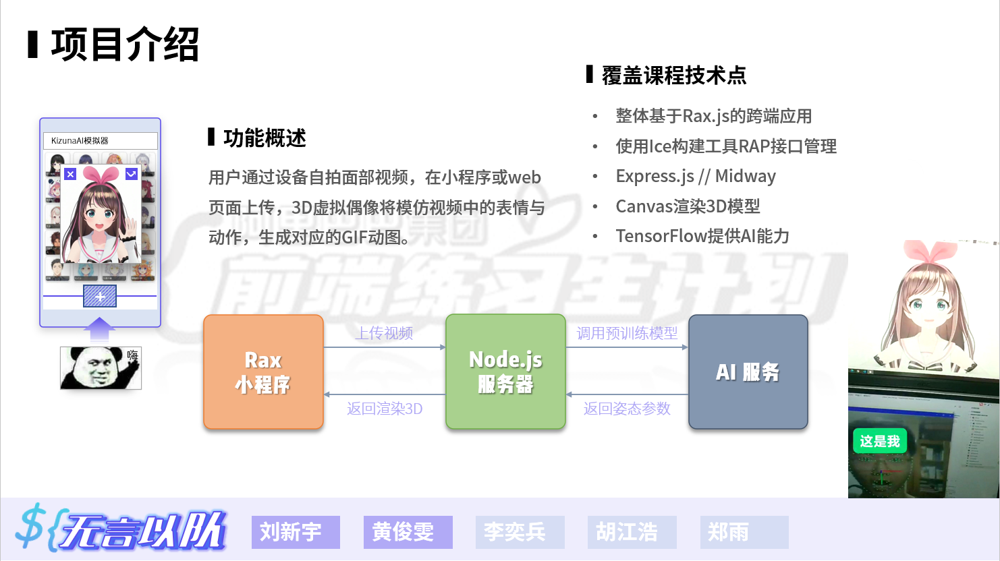

## 目录说明
- Rax_kizunaAI：小程序本体（界面图片资源存放于APIServer）；
- RenderServer：3D模型与通信渲染服务器（mock.ipynb可模拟生成模型推断参数令前端渲染）；
- APIServer_expjs：Express.js实现的资源存取&通信接口服务器；/service为AI模型（python）；
- APIServer_midway：Midway.js实现的资源存取&通信接口服务器；无AI模型；
（也就是说我们做了两个版本的Node服务器，expjs版本是完全调通可用的）

## 顺序与端口号
- 先启动资源与接口服务器port:5678
- 模型渲染动图生成服务器port:6789
- Rax跨端应用运行在端口port:3333

## 呃……
- 📳Rax应用完全没做移动端布局适配 请在iPhone 6/7/8 Plus的屏幕模拟环境启动
- ⚠AI部分推断时需要3G以上的GPU资源〽
- 🕧AI部分只能处理30帧，过长显卡会报错，因此程序被设置为达到帧数自尽
- python环境以及深度学习库未安装在本平台，无显卡无环境故没办法部署完整的项目
- 🚧两套APIServer待整合 正在施工中

## 组员代码仓库
- 服务器Midway版  在https://github.com/hjwforever/midway-demo
- 服务器Express版 在https://github.com/melxy1997/kizunaAI
- Rax小程序       在https://github.com/melxy1997/rax_interface